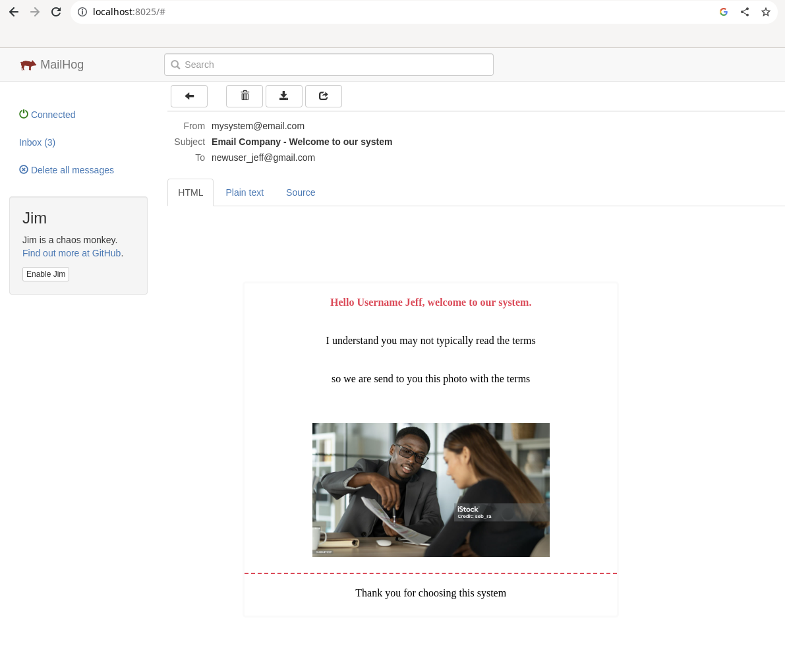

# Email API
  ### A simple NodeJS API Example to send email, this project use more function desing.

 


## Requirements
  You need install docker and docker compose.
  To run use:
  ```
  $ docker-compose up
  ```

## NodeJS API
 You can import postman colletion in documentation folder.
 ```
  http://localhost:8080/
 ```


## MailHog (Email interface)
  open url to see recived email.

 ```
  http://localhost:8025/
 ```


